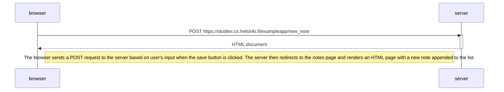

```mermaid
sequenceDiagram
    participant browser
    participant server

    browser->>server: POST https://studies.cs.helsinki.fi/exampleapp/new_note
    activate server
    server-->>browser: HTML document
    deactivate server

    Note right of browser: The browser sends a POST request to the server based on user's input when the save button is clicked. The server then redirects to the notes page and renders an HTML page with a new note appended to the list.
```